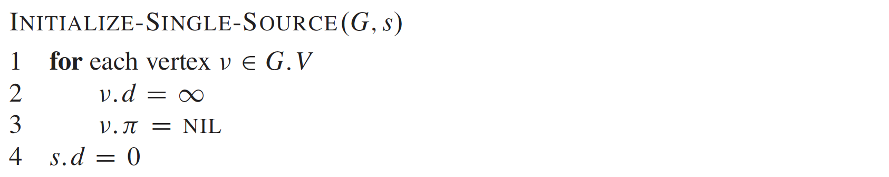

# Shortest Path

### Dijkstra's Algorithm

* Single source shortest paths - Shortest paths from a source to all other nodes.
* Greedy Algorithm
* Good with positive weights, as we can use visited.
* Uses Prim's technique.
* Time complexity = O((E+V) \* log(V)) with min-heap. **E is a must here but in case E << V.**&#x20;
* Can store parent in the node to print the path.
* **In the implementation, we can keep appending vertices to min-heap.** Because in a heap we can't change the distance, based on which the heap is created. Time complexity remains O(E log(v)) as log(E) = log(V).

<figure><figcaption></figcaption></figure>

<figure><figcaption></figcaption></figure>

<figure><figcaption></figcaption></figure>

### Bellman-Ford

* **Can handle negative weight edges.**
* Time complexity = O(V\*E).
* Implementation is simple, with for loop on vertices and edges.

<figure><figcaption></figcaption></figure>
