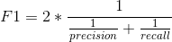
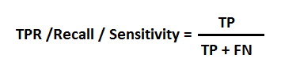

# Evaluation Metrics

#### **Classification Accuracy**&#x20;

_number of correct predictions / total number of input samples_

_(Not good when samples distribution is highly unequal, like 98% class A, 1% class B)_

_**Logarithmic Loss**_ (works well with multi class)

#### **Confusion Matrix**

| **n = 165** | Predicted: No | Predicted: Yes |
| ----------- | ------------- | -------------- |
| Actual: No  | 50            | 10             |
| Actual: Yes | 5             | 100            |

_True Positives: The cases in which we predicted YES and the actual output was also YES._

_True Negatives: The cases in which we predicted NO and the actual output was NO._

_False Positives: The cases in which we predicted YES and the actual output was NO._

_False Negatives: The cases in which we predicted NO and the actual output was YES._

#### **Area under Curve** (used in binary classification)

True Positive Rate (Sensitivity) = TP/ (FN+TP)

False Positive Rate (Specificity) = FP / (FP+TN)

FPR, TPR \[0, 1]

AUC = area between FPR and TPR drawn at different threshold like (0.02, 0.04, …, 1), it means higher AUC => Better the model performs, AUC \[0, 1]

**F1 Score** (F1 Score is used to measure a test’s accuracy)

Harmonic mean of precision and recall

F1 \[0, 1]; It tells you how precise your classifier is (how many instances it classifies correctly), as well as how robust it is (it does not miss a significant number of instances). Higher F1 => Better model performance

Precision =

Recall =

**Mean Absolute Error**

**Mean Squared Error**

